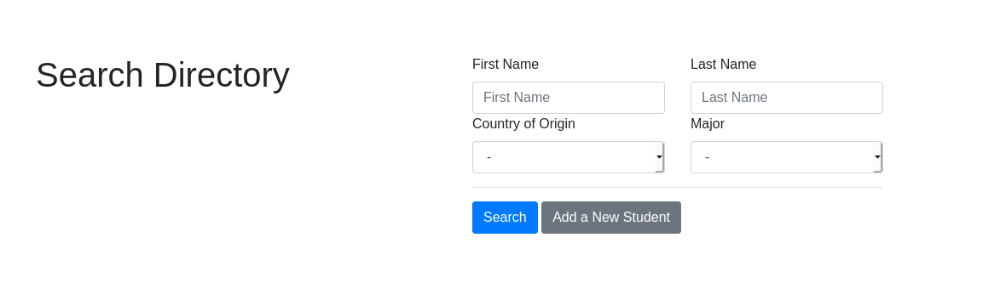
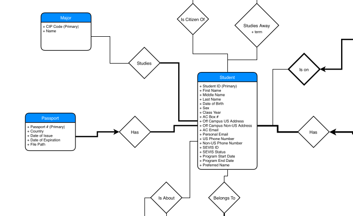
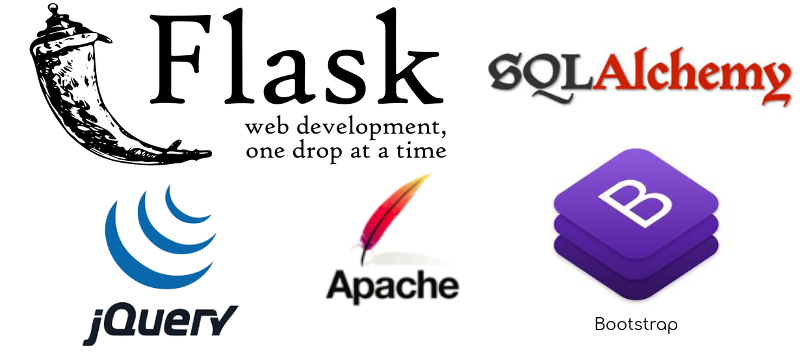

# CISE DB and WebApp

This project is a prototype database and web application for the Center for International Student Engagement at Amherst College. This project was demoed on December 2019. 

## Functionality

1. Our homepage allows administrators to query Postgres and filter student results.

2. We include a fully searchable directory for students. 

3. Each student has a profile with additional information. Get to this page through the results page.

## Database Design

We design a database from scratch and include a snippet of the full Entity-Relational diagram.

## Tech Stack

This project includes a Postgres DB connected to a Python Flask backend that renders templates using Bootstrap for styling and JQuery for simple interactivity. This project was deployed to an Apache web server with SSL configured.

## Team
- Shukry Zablah (shukryzablah.com)
- Noah Aube
- Billy Jang
- Brandt Dudziak
